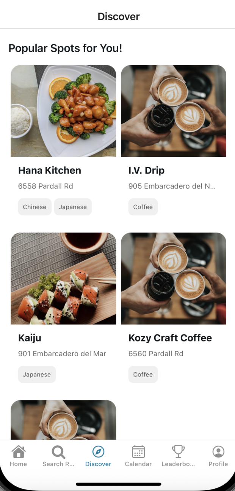
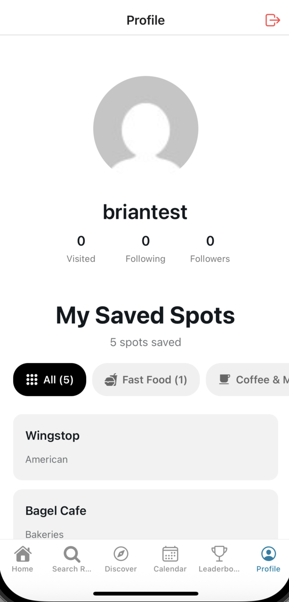

# HW04 Scope

The planned contribution for HW04 is to implement the last couple of features to the SBEats app as well as make a few tweaks to improve the user experience of the app.

More specifically, I plan to create the "Add Friends" feature that allows users to become friends with one another in order to faciliate the social aspect of the app. This means having a place on a user profile to send friend requests and also be able to accept incoming friend requests.

We will also improve the experience of the discover page by also allowing users to find others as well. It won't exclusively just be for finding new restaurants.

# HW04 Starting Point

The current situation of the app is that users currently don't have the ability to easily find other users and become friends with them. As you can see with the user_profile and the discover_page images below, there is no functionality to add friends nor find other users easily. The profile page currently only has information about the profile itself and the discover page only has sections for finding restaurants.

# What HW04 Will Change

After HW04, we should have 3 major changes to the app. The first is adding a "Add Friend" button on a user profile which allows others to send friend requests. This will be located right under the profile picture.

The second change is being able to accept incoming friend requests. There will be a button in the top right corner of the profile page that will open a page that allows users to see their incoming requests. From there, they can either accept or deny the request.

The last change is adding a section in the Discover Page to find other users. This will appear at the top of the discover page and the users will just be presented as a list where you can click on the profile in order to add them as friends.