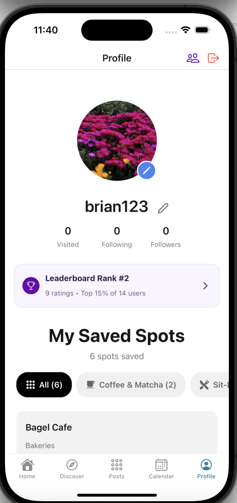
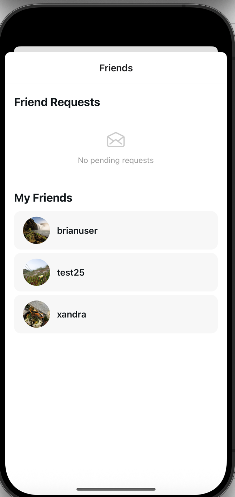
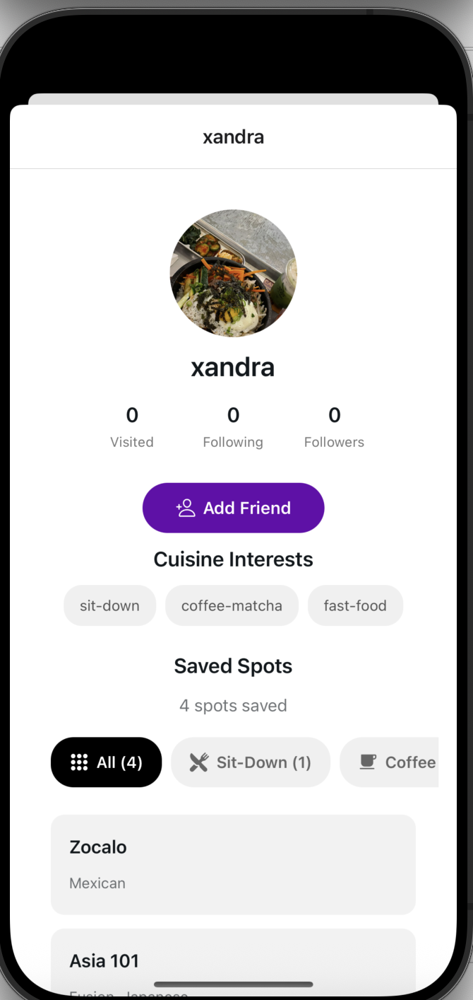

# HW04 Contribution

The starting point and scope of my HW04 contribution are located in HW04.md.

## Structure of My Contribution

My contributions were implemented through **two separate pull requests**.

### 1. Friends Feature

The first pull request introduced a **friends system** that allows users to send, accept, and deny friend requests, as well as view their list of friends.

The following folders/files that were a part of this contribution were:

* **`SBEats/app/(tabs)/profile.tsx`**
  Modified to include a **friends icon** on the profile page. This icon allows users to access friend-related functionality, including viewing current friends and managing incoming friend requests.

* **`SBEats/types/FriendRequest.ts`**
  Added a helper type used to structure the two ends of a friend request relationship between users.

* **`SBEats/services/friendService.ts`**
  Introduced a new `services` folder and created this file to contain the logic responsible for updating the database when users **send, accept, or deny friend requests**.

* **`SBEats/app/friend-requests.tsx`**
  Added a dedicated page where users can view and manage incoming friend requests.

* **`SBEats/app/user/[id].tsx`**
  Modified to include a **Send Friend Request** button when viewing another user's profile.

### 2. Discover Page Improvements

The second pull request enhanced the **Discover page** by enabling users to discover other users with similar interests. The changes introduced a new section on the page and provided navigation to user profile pages through a **modal popup**.

The following files were modified or added:

* **`SBEats/app/(tabs)/discover.tsx`**
  Modified to add a **Discover Users** section at the top of the page. This section displays users that may be relevant based on shared interests.

* **`SBEats/app/user/[id].tsx`**
  Added to support viewing a user's profile when selecting a user from the Discover page.

## Main Results

The implemented changes resulted in the following functionality improvements:

1. The **Discover page** now includes a **Discover Users section** at the top, allowing users to find other users with similar interests.

2. Users can **select another user from the Discover page**, view their profile, and send them a friend request.

3. On a user's own **profile page**, a **people icon** appears in the top right corner. Selecting this icon opens a page where users can:

   * View their current friends
   * See incoming friend requests
   * Accept or deny friend requests
   * Navigate to the profiles of their friends

4. When a user **accepts a friend request**, the friend button state is updated to reflect the new relationship. This prevents duplicate friend requests from being sent to the same user.

## Screenshots and Demos

**Screenshot of the new profile page with the friends icon located on the top-right corner**

**Screenshot of New Friend Requests Screen**

**Screenshot of New Add a Friend Button**

**Here is a demo for sending a friend request**

https://github.com/user-attachments/assets/c4df6ba8-da70-41ad-b25d-5b772938ccb6

**Here is a demo for accepting a friend request and seeing the updated status**

https://github.com/user-attachments/assets/4ce91433-bdd5-451e-aabc-da79d8b3cf78
